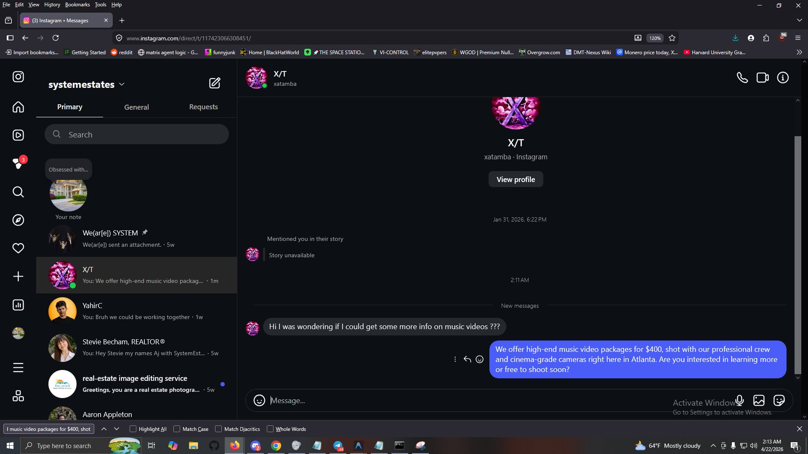

# S66 Reachout Bot (VLA Sovereign Agent)



The **S66 Reachout Bot** is a Vision-Language-Action (VLA) Sovereign Agent built for System Films in Atlanta. It autonomously navigates the Instagram Desktop UI, visually hunts for inbound leads using Computer Vision, evaluates the conversation context using Cognitive AI, and dynamically generates personalized $400 music video pitches.

## System Architecture

The bot operates on an Infinite State Machine (FSM) loop with three core engines:
1. **Optics Layer (`pkg/optics`)**: Uses Google Vertex AI (Gemini 2.5 Flash) to analyze spatial UI coordinates and perform cognitive evaluations of chat history.
2. **Motor Layer (`pkg/hardware`)**: Uses `robotgo` to hijack physical OS-level mouse and keyboard drivers for human-like kinematic movement (bezier curves).
3. **Cognitive Engine (`SKILL.md`)**: Injects the System Films persona to dynamically draft unique pitches.

---

## Team Deployment & Cloud Billing

The S66 Bot runs on a centralized **Google Cloud Platform (GCP)** architecture (`matrix-esa-production`). 
**DO NOT distribute API keys or Service Account JSON files.** 

Instead, the billing and infrastructure are centrally controlled by the System Films Administrator using GCP Identity and Access Management (IAM). 

### Setup Instructions for Teammates

If you are a System Films teammate installing this on your laptop, follow these steps exactly:

1. **Install Prerequisites**:
   - Install [Go (Golang)](https://go.dev/dl/).
   - Install [TDM-GCC](https://jmeubank.github.io/tdm-gcc/) (Required for CGO hardware drivers). Add it to your Windows `PATH`.
   - Install the [Google Cloud CLI](https://cloud.google.com/sdk/docs/install).

2. **Authenticate with Google Cloud**:
   Open your terminal and run the following command to authenticate using your corporate Google account:
   ```bash
   gcloud auth application-default login --quota-project=matrix-esa-production
   ```
   *(Note: The System Admin must add your Google email to the GCP IAM as a `Vertex AI User` before this will work).*

3. **Clone and Compile**:
   ```powershell
   git clone https://github.com/alex-cyr/system-dm-bot.git
   cd system-dm-bot
   go build -ldflags="-s -w" -o s66-bot.exe ./cmd/s66-bot/main.go
   ```

---

## Execution Manual (God Mode)

Before running the agent, you must set up your physical desktop environment.

1. **Hardware Setup**: Move your web browser to your **Primary Monitor**. Ensure it is fully maximized.
2. **Instagram Setup**: Log into the designated System Films Instagram account and open the DM Inbox page (`instagram.com/direct/inbox/`).
3. **Launch the Engine**: Open your terminal, ensure it is visible at the bottom of the screen, and run:
   ```powershell
   .\s66-bot.exe
   ```
4. **Hands Off**: The moment you hit enter, take your hand off the physical mouse. The Sovereign Agent is now driving.

### The Kill Switch (Emergency Stop)
Because the bot hijacks your physical mouse drivers and runs on an infinite loop, it will not stop until you physically intervene. 
If it enters a chaotic state or you need to shut it down, **drag your mouse to the terminal and press `CTRL + C` on your keyboard.** This instantly kills the CGO process.
